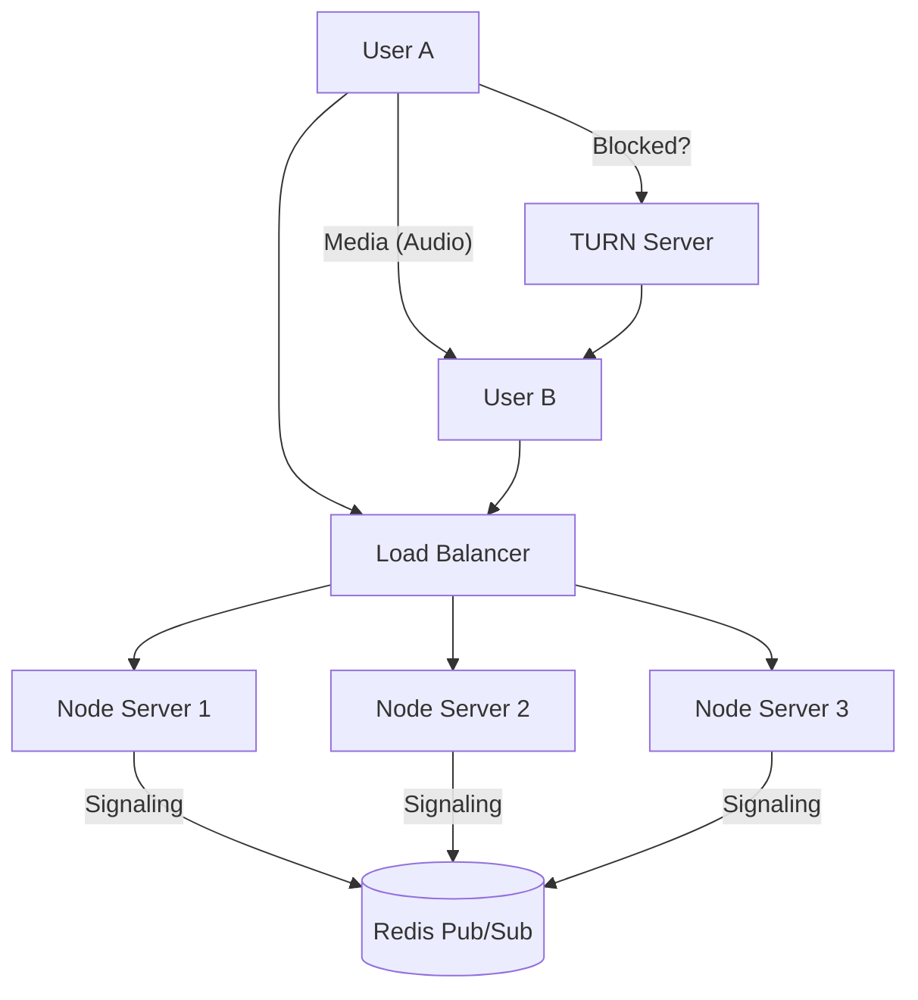

# Scalability Analysis & Roadmap

## Current Status: Prototype
The current application is designed as a **Proof of Concept (PoC)**.
-   **Capacity**: Can handle ~100-500 concurrent users on a single decent server.
-   **Architecture**: Single Node.js process with in-memory storage.
-   **Media**: Peer-to-Peer (P2P).

## Will it handle "lots of traffic"?
**As is? No.**
If you have thousands of users, the single server will become a bottleneck, and if it crashes, everyone disconnects.

## Roadmap to High Traffic (Production Grade)

To handle thousands or millions of users (like WhatsApp), you need to implement the following architecture changes:

### 1. Horizontal Scaling (The "Multiple Servers" Fix)
Instead of one big server, you run many small servers behind a Load Balancer.
-   **Problem**: Currently, if User A is on Server 1 and User B is on Server 2, they can't find each other because the `users` list is local to each server.
-   **Solution**: Use **Redis**.
    -   **Store Users in Redis**: Move the `users = {}` object to a Redis database so all servers can access the same user list.
    -   **Socket.io Redis Adapter**: This allows Server 1 to send a message to User B on Server 2.

### 2. Dedicated TURN Servers (Reliability)
-   **Problem**: P2P connections fail for ~20% of users (corporate firewalls, mobile networks).
-   **Solution**: Deploy a fleet of **TURN Servers** (using open-source **Coturn** or services like **Twilio**). This relays traffic when P2P fails. This is the most expensive part of scaling a VoIP app.

### 3. WebSocket Optimization
-   **Heartbeats**: Tune heartbeat intervals to reduce bandwidth.
-   **Compression**: Enable WebSocket compression (permessage-deflate).

## Architecture Diagram (High Scale)

## Estimated Capacity per Stage

| Stage | Architecture | Concurrent Users | Cost |
| :--- | :--- | :--- | :--- |
| **Prototype** (Current) | Single Node Process | < 500 | $0 - $7/mo |
| **MVP** | Node Cluster + Redis | 5,000+ | $50 - $200/mo |
| **Scale** | Kubernetes + Auto-scaling | 100,000+ | $1,000+/mo |
